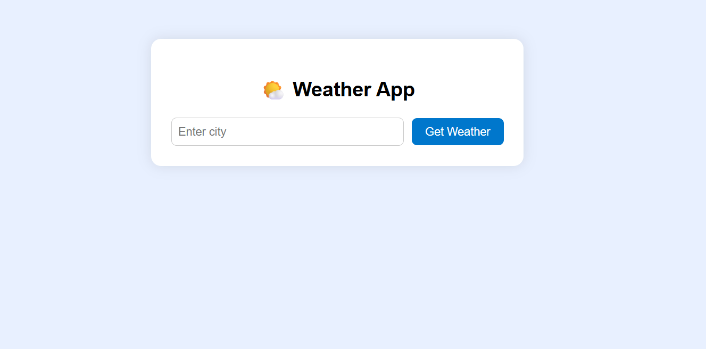
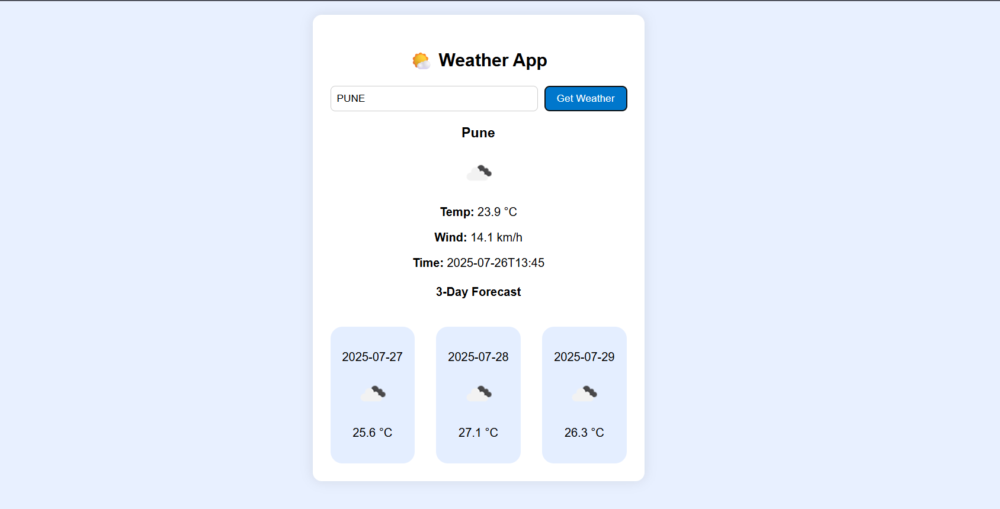

# 🌤️ MyWeather

**MyWeather** is a simple and responsive Angular application that allows users to check real-time weather data for any city using a public weather API.

---

## 🔗 Live Demo

🌐 [Click here to view the app on Vercel](https://myweather-nine.vercel.app/)

---

## 🚀 Features

- 🌍 Search weather by city name
- 🌡️ Display temperature, weather condition, humidity, and wind speed
- 📱 Responsive and mobile-friendly UI
- 🔌 Uses a free weather API (like OpenWeatherMap)

---

## 🛠️ Built With

  
  
  
  
  

---
## 🌐 API Used
- OpenWeatherMap API

--- 

## 📸 Screenshots

### 🔹 Home Page

### 🔹 Weather Result

---

## 🧑‍💻 Author
- Shivam Pisal – [GitHub](https://myweather.vercel.app)

